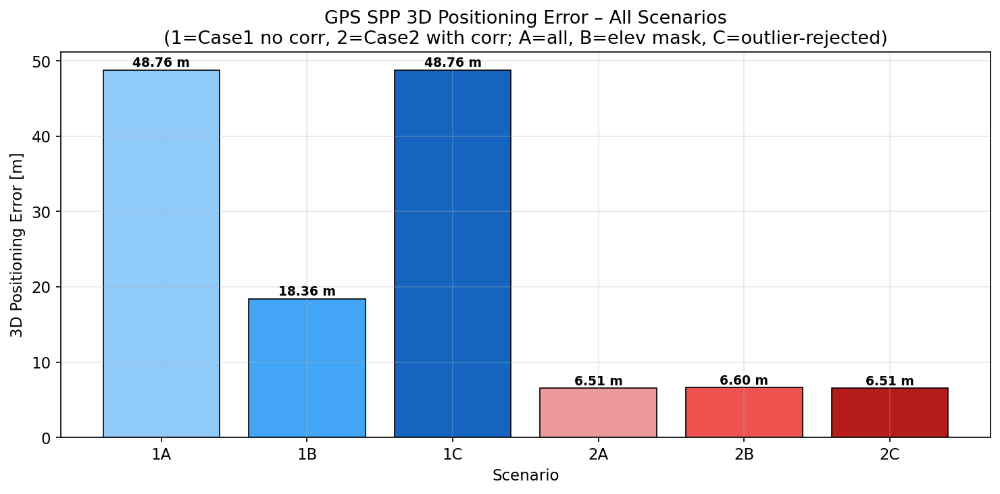
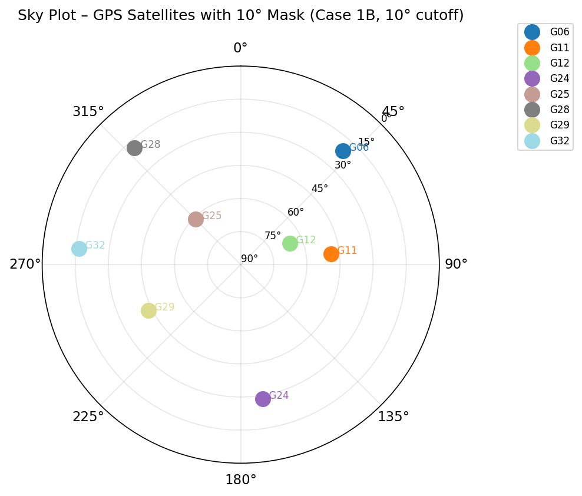
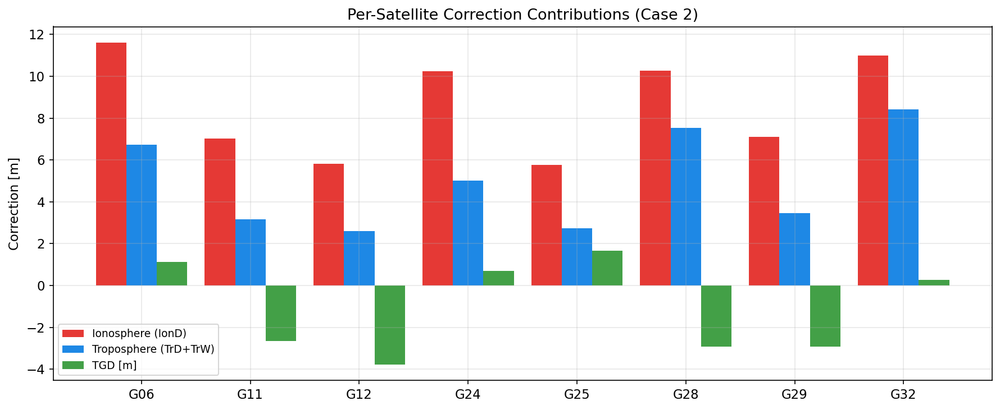
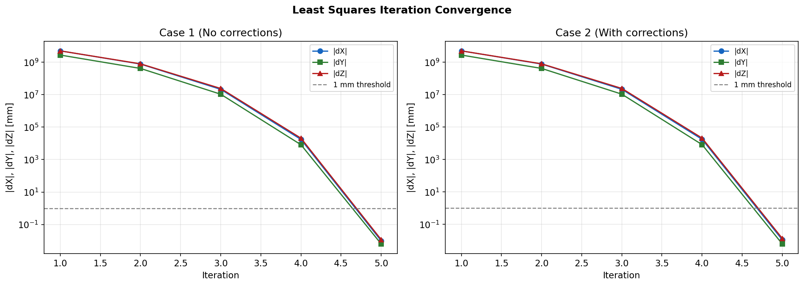
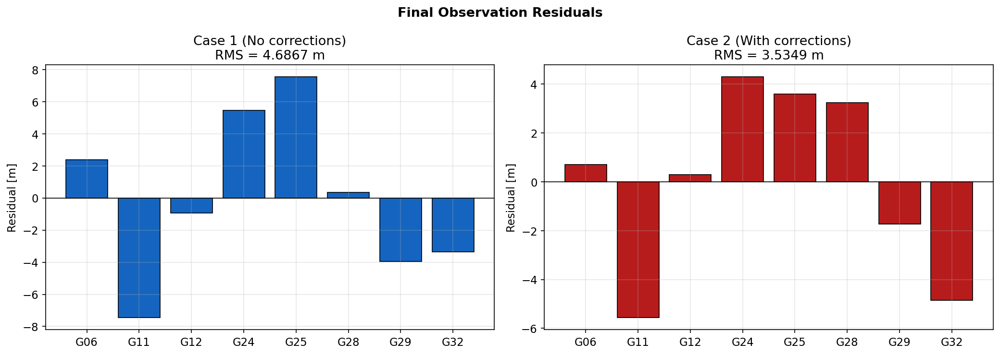

# GPS Single Point Positioning (SPP) via Iterative Least Squares

A Python implementation of GPS code-based single point positioning using iterative Weighted Least Squares. Given a RINEX observation file, an SP3 precise ephemeris, and a broadcast navigation file, the script estimates the 3D ECEF coordinates of a receiver and quantifies the impact of atmospheric corrections on positioning accuracy.

---

## What it does

The script reads raw GPS C/A pseudorange observations (C1C) and computes the receiver's position by solving the nonlinear pseudorange equation iteratively. Starting from the ECEF origin `(0, 0, 0)`, it refines the position estimate epoch by epoch until coordinate updates are smaller than 1 mm.

Six positioning scenarios are computed and compared automatically:

| Scenario | Satellites | Corrections |
|----------|-----------|-------------|
| Case 1A  | All available | None |
| Case 1B  | 10° elevation mask | None |
| Case 1C  | Outlier-rejected | None |
| Case 2A  | All available | Iono + Tropo + TGD |
| Case 2B  | 10° elevation mask | Iono + Tropo + TGD |
| Case 2C  | Outlier-rejected | Iono + Tropo + TGD |

**Sample results** — ISTA station (Istanbul), DOY 075, 2026:

| Scenario | 3D Error |
|----------|----------|
| Case 1A (no corrections, all sats) | 41.63 m |
| Case 2A (with corrections, all sats) | 7.18 m |
| Case 2B (with corrections, 10° mask) | **6.67 m** |

---

## Key features

- **RINEX 2 & 3 parser** — handles both observation file formats, including multi-line continuation records and variable observations-per-line layouts
- **SP3 precise ephemeris** — 9th-degree Lagrange interpolation over a 10-epoch window for sub-centimetre satellite position accuracy
- **Emission time iteration** — satellite position evaluated at signal emission time, not reception time
- **Sagnac (Earth rotation) correction** — R₃ rotation applied to account for ECEF frame rotation during signal travel (~75 ms → ~28 m effect if omitted)
- **Klobuchar ionospheric model** — uses α/β coefficients from the navigation file header to estimate L1 slant delay via the ionospheric pierce point
- **Collins (1999) SBAS tropospheric model** — tabulated meteorological parameters interpolated to receiver latitude, mapped to slant delay
- **TGD correction** — Total Group Delay hardware bias read from the broadcast navigation message
- **Outlier detection** — statistical rejection based on deviation from the median `Lc − ρ(GT)` diagnostic
- **GUI file selection** — all input files are selected via Tkinter dialogs at runtime; no hardcoded paths

---

## Output figures

All figures are saved to an `output/` folder selected at startup.

| File | Description |
|------|-------------|
| `skyplot_project.png` | Sky plot of GPS satellites after elevation mask |
| `convergence_project.png` | Least Squares iteration convergence (log scale) |
| `corrections_project.png` | Per-satellite ionospheric, tropospheric, and TGD corrections |
| `residuals_project.png` | Final observation residuals for Case 1B and Case 2B |
| `earth_rotation_project.png` | Coordinate shift caused by omitting the Sagnac correction |
| `scenario_comparison.png` | 3D positioning error bar chart across all six scenarios |

<p align="center">
  
</p>

<p align="center">
  
  
</p>

<p align="center">
  
  
</p>

---

## Required input files

| File | Format | Description |
|------|--------|-------------|
| RINEX Observation file | `.rnx` / `.26o` | C/A pseudorange observations (C1C), 30-second sampling |
| RINEX Navigation file | `.26n` / `.rnx` | Broadcast ephemeris + Klobuchar α/β header coefficients |
| SP3 Precise Ephemeris | `.SP3` | IGS final orbit, 15-minute intervals |
| `Ion_Klobuchar.py` | Python module | Klobuchar ionospheric delay function |
| `trop_SPPn.py` | Python module | Collins SBAS tropospheric delay function |

`Ion_Klobuchar.py` and `trop_SPPn.py` are auto-detected if placed in the same directory as the main script. Otherwise, a file dialog will prompt for them.

---

## Dependencies

```
numpy
matplotlib
```

Standard library only beyond these (`os`, `sys`, `math`, `re`, `importlib`, `tkinter`).

Install with:
```bash
pip install numpy matplotlib
```

---

## Usage

```bash
python Azra_Sugec_TermProject.py
```

A series of Tkinter dialogs will open:

1. **Output folder** — choose where the `output/` directory is created
2. **RINEX Observation file**
3. **RINEX Navigation file**
4. **SP3 Precise Ephemeris**
5. **Ion_Klobuchar.py** *(skipped if found automatically)*
6. **trop_SPPn.py** *(skipped if found automatically)*

Results are printed to the console and all figures saved automatically.

---

## Observation model

The C/A pseudorange equation:

```
P_i = ρ_i + c·δt_r − c·δt_s^(i) + I_i + T_i + TGD_i + ε_i
```

Rearranged as a corrected observation:

```
Lc_i = P_i + c·δt_s^(i) − I_i − T_i − TGD_i  =  ρ_i + c·δt_r
```

This is linearised around the current approximate position and solved via:

```
x = (AᵀA)⁻¹ Aᵀ l
```

where `x = [ΔX, ΔY, ΔZ, c·Δδt_r]ᵀ`. The position is updated and the process repeats until `|ΔX|, |ΔY|, |ΔZ| < 1 mm`.

---

## Physical constants (WGS84 / GPS ICD)

| Constant | Value |
|----------|-------|
| Speed of light | 299 792 458 m/s |
| Gravitational constant μ | 3.986005 × 10¹⁴ m³/s² |
| Earth rotation rate ω_E | 7.2921151467 × 10⁻⁵ rad/s |
| WGS84 semi-major axis | 6 378 137.0 m |
| WGS84 inverse flattening | 298.257223563 |

---

## Reception epoch computation

The observation epoch is derived from a student/user ID digit sum:

```
t_raw = (Σ digits) × 960  [seconds of day]
t_rec = t_raw + 810  if  t_raw % 900 == 0,  else  t_rec = t_raw
```

This can be adapted in `compute_reception_epoch()` for any numeric ID.
