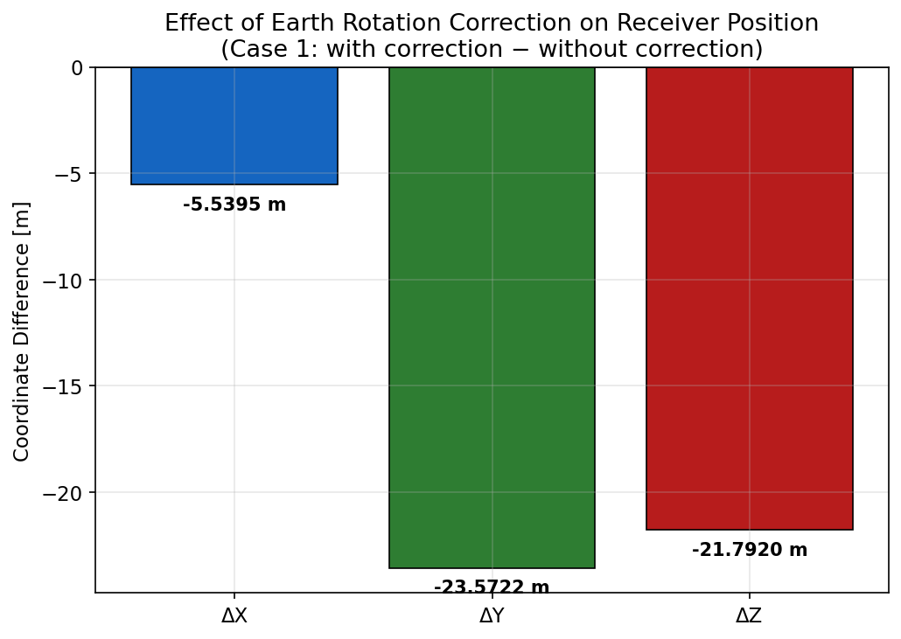

# GPS Single Point Positioning via Iterative Least Squares

A from-scratch Python implementation of **GPS code-based Single Point Positioning (SPP)** using iterative Least Squares estimation. The script takes real GNSS data files as input and estimates a receiver's 3D ECEF coordinates, while quantifying the effect of atmospheric corrections, satellite geometry, and the Earth rotation (Sagnac) correction on positioning accuracy.

---

## Overview

GPS positioning with a single receiver requires solving a nonlinear system: for each satellite, the measured pseudorange is a function of the unknown receiver position and clock bias. This script linearises that system around a current estimate and solves it iteratively via Least Squares, starting cold from the ECEF origin `(0, 0, 0)` and converging to millimetre-level updates in 5 iterations.

Six positioning scenarios are computed in a single run by combining two correction strategies with three satellite selection strategies:

| Scenario | Satellites used | Atmospheric corrections |
|----------|----------------|------------------------|
| **Case 1A** | All visible | None |
| **Case 1B** | 10° elevation mask | None |
| **Case 1C** | Outlier-rejected | None |
| **Case 2A** | All visible | Klobuchar iono + Collins tropo + TGD |
| **Case 2B** | 10° elevation mask | Klobuchar iono + Collins tropo + TGD |
| **Case 2C** | Outlier-rejected | Klobuchar iono + Collins tropo + TGD |

**Case 2B** (masked + corrected) is the canonical best result.

### Sample results — ISTA station (Istanbul), 16 March 2026, 08:16:00 UTC

| Scenario | 3D positioning error |
|----------|---------------------|
| Case 1A — all sats, no corrections | 41.63 m |
| Case 1B — 10° mask, no corrections | 18.90 m |
| Case 2A — all sats, with corrections | 7.18 m |
| **Case 2B — 10° mask, with corrections** | **6.67 m** |

<p align="center">
  
</p>

---

## Processing pipeline

```
Student ID
    │
    ▼
Reception epoch  ──►  RINEX obs parser  ──►  Target epoch + C1 pseudoranges
                            │
                            ▼
                       SP3 parser  ──►  10-epoch Lagrange window per satellite
                            │
                            ▼
                    Emission time iteration  ──►  Satellite ECEF at t_emit
                            │
                            ▼
                    Earth rotation (R3)  ──►  Sagnac-corrected satellite position
                            │
                ┌───────────┴───────────┐
                │                       │
           Case 1                   Case 2
        (no corrections)       (iono + tropo + TGD)
                │                       │
                └───────────┬───────────┘
                            │
                    Iterative Least Squares
                    x = (AᵀA)⁻¹ Aᵀ l
                    until |ΔX|,|ΔY|,|ΔZ| < 1 mm
                            │
                            ▼
                  Coordinates + residuals + figures
```

---

## Observation model

The C/A pseudorange equation for satellite *i*:

```
P_i = ρ_i + c·δt_r − c·δt_s^(i) + I_i + T_i + TGD_i + ε_i
```

| Symbol | Meaning |
|--------|---------|
| `ρ_i` | Geometric range from receiver to satellite |
| `c·δt_r` | Receiver clock bias (unknown, estimated) |
| `c·δt_s` | Satellite clock correction (from SP3) |
| `I_i` | Ionospheric delay — Klobuchar model |
| `T_i` | Tropospheric delay — Collins SBAS model |
| `TGD_i` | Total Group Delay hardware bias (from nav file) |

Moving all known terms to the left gives the corrected observation `Lc_i`, which is linear in the unknowns:

```
Lc_i = P_i + c·δt_s − I_i − T_i − TGD_i  =  ρ_i + c·δt_r
```

Linearised around current estimate `r₀`:

```
A · [ΔX  ΔY  ΔZ  c·Δδt_r]ᵀ  =  l

where A_i = [−eˣ  −eʸ  −eᶻ  1]
```

Solution: `x = (AᵀA)⁻¹ Aᵀ l`

---

## Atmospheric corrections

### Ionosphere — Klobuchar model

The ionosphere delays L1 signals by 5–12 m depending on elevation. A single-frequency receiver cannot measure this directly, so the Klobuchar model estimates it using 4 α and 4 β coefficients broadcast in the navigation file. The model computes the ionospheric pierce point at 350 km altitude and scales the vertical delay to slant via an obliquity factor.

### Troposphere — Collins (1999) SBAS model

The troposphere causes a non-dispersive delay (invisible to dual-frequency). The Collins model uses tabulated meteorological parameters at five reference latitudes, interpolated to the receiver latitude with a seasonal cosine correction. Zenith dry and wet delays are mapped to slant using:

```
M(E) = 1.001 / √(0.002001 + sin²E)
```

This mapping function grows rapidly below 5°, which is why satellites below 10° elevation are unreliable.

### Why the elevation mask matters

<p align="center">
  
</p>

The satellite G21 at 1.6° elevation has a tropospheric slant correction of **44.8 m** — a value the model cannot reliably produce. Excluding it with a 10° mask reduces the uncorrected 3D error from 41.6 m to 18.9 m (a 55% improvement).

---

## Satellite geometry

<p align="center">
  
</p>

Sky plot after the 10° elevation mask. 8 of 9 available GPS satellites are retained. The two highest-elevation satellites are G12 (64.9°) and G25 (61.9°), providing a strong geometry. Azimuth increases clockwise from North; rings mark elevation at 15° intervals.

---

## Iteration convergence

The solver starts from `(0, 0, 0)` — approximately 6400 km from the true position. The large first step is expected; successive iterations reduce by orders of magnitude and the solution converges to below the 1 mm threshold at iteration 5 in both cases.

<p align="center">
  
</p>

---

## Residual analysis

<p align="center">
  
</p>

Final observation residuals `v_i = Lc_i − (ρ_i + c·δ̂t_r)`. The mean is identically zero by construction in unweighted Least Squares. Applying atmospheric corrections reduces the RMS from **4.76 m → 3.48 m**. G32, the lowest-elevation satellite retained after the mask (15.8°), consistently shows the largest residual in both cases, consistent with elevated multipath at low elevation.

---

## Earth rotation (Sagnac) correction

GPS signals take ~75 ms to travel from satellite to receiver. During that time the Earth rotates by `ω_E · Δt ≈ 5.5 µrad`, moving the ECEF frame. The satellite position computed at emission time must be rotated into the reception-epoch frame:

```
r_final = R₃(ω_E · Δt) · r_sat
```

<p align="center">
  
</p>

Omitting this correction introduces a **28.3 m** position error. The dominant effect is in the Y component (−23.4 m) because the R₃ rotation acts about the Z-axis, and the ISTA station at ~41°N has a large Y coordinate in ECEF.

---

## Repository structure

```
.
├── Azra_Sugec_TermProject.py   # Main script
├── Ion_Klobuchar.py            # Klobuchar ionospheric correction module
├── trop_SPPn.py                # Collins SBAS tropospheric correction module
├── README.md
└── img/
    ├── scenario_comparison.png
    ├── skyplot_project.png
    ├── corrections_project.png
    ├── convergence_project.png
    ├── residuals_project.png
    └── earth_rotation_project.png
```

Output figures are saved to an `output/` subdirectory chosen at runtime.

---

## Required input files

| File | Format | Description |
|------|--------|-------------|
| RINEX Observation file | `.rnx` / `.26o` | C/A pseudorange (C1C), 30-second sampling |
| RINEX Navigation file | `.26n` / `.rnx` | Broadcast ephemeris + Klobuchar α/β coefficients |
| SP3 Precise Ephemeris | `.SP3` | IGS final orbit, 15-minute intervals |
| `Ion_Klobuchar.py` | Python module | Klobuchar ionospheric delay function |
| `trop_SPPn.py` | Python module | Collins SBAS tropospheric delay function |

`Ion_Klobuchar.py` and `trop_SPPn.py` are auto-detected if placed in the same folder as the main script.

---

## Dependencies

```
numpy
matplotlib
```

All other imports (`os`, `sys`, `math`, `re`, `importlib`, `tkinter`) are from the Python standard library.

```bash
pip install numpy matplotlib
```

---

## Usage

```bash
python Azra_Sugec_TermProject.py
```

A series of Tkinter GUI dialogs will open:

1. **Output folder** — an `output/` subfolder is created here for all figures
2. **RINEX Observation file**
3. **RINEX Navigation file**
4. **SP3 Precise Ephemeris**
5. **`Ion_Klobuchar.py`** *(auto-detected if in same folder)*
6. **`trop_SPPn.py`** *(auto-detected if in same folder)*

Results print to the console; all six figures save automatically.

---

## Physical constants (WGS84 / GPS ICD)

| Constant | Symbol | Value |
|----------|--------|-------|
| Speed of light | c | 299 792 458 m/s |
| Gravitational constant | μ | 3.986005 × 10¹⁴ m³/s² |
| Earth rotation rate | ω_E | 7.2921151467 × 10⁻⁵ rad/s |
| WGS84 semi-major axis | a | 6 378 137.0 m |
| WGS84 inverse flattening | 1/f | 298.257223563 |

---

## Reception epoch formula

The target observation epoch is derived from a numeric user ID:

```python
digit_sum = sum(int(d) for d in student_id)
t_raw     = digit_sum * 960          # seconds of day
t_rec     = t_raw + 810 if t_raw % 900 == 0 else t_raw
```

This can be adapted in `compute_reception_epoch()` for any numeric identifier.
